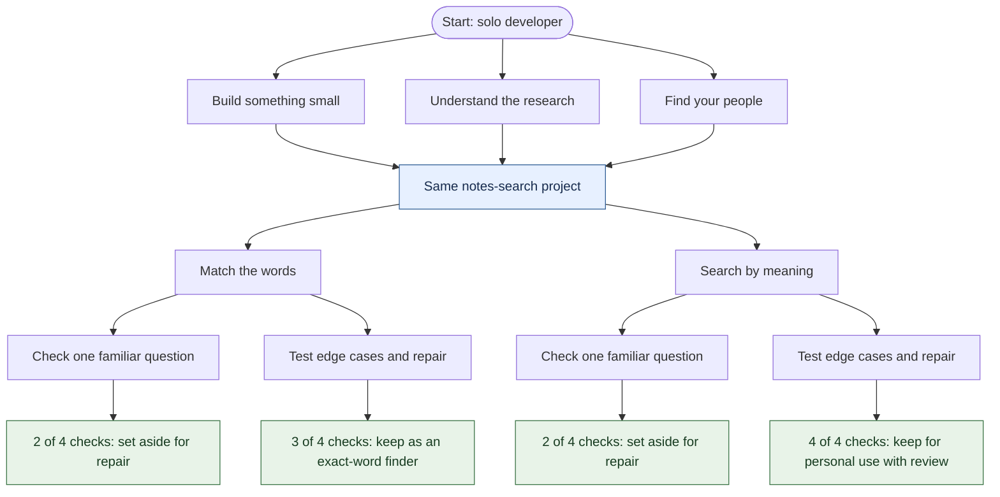
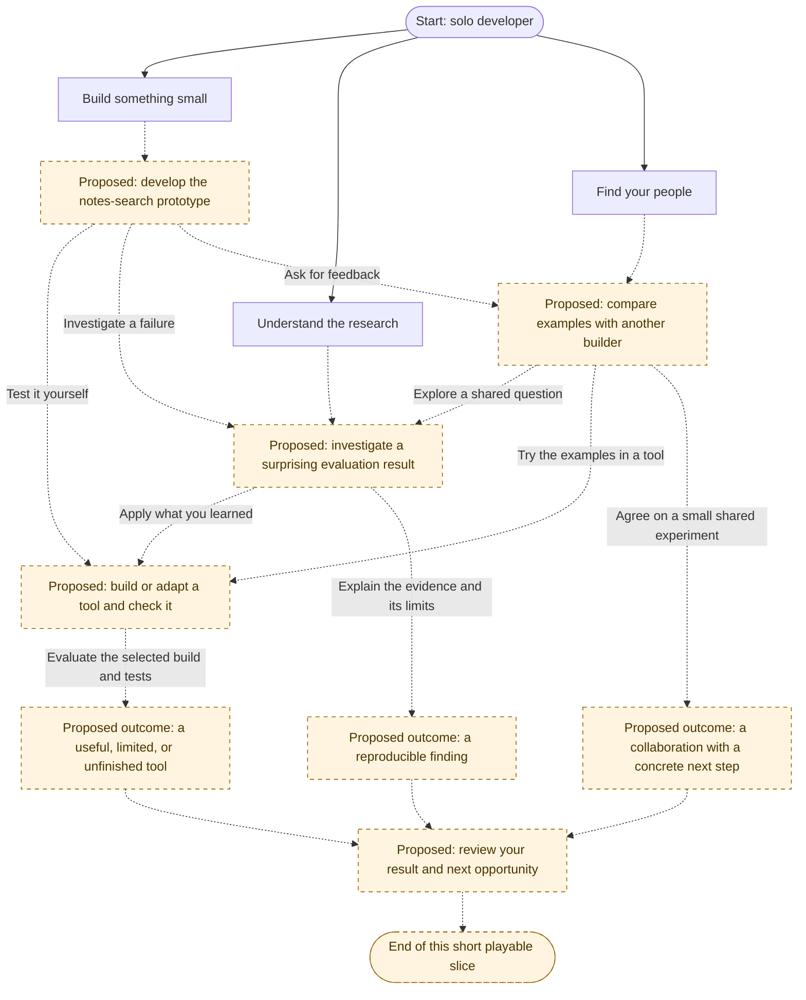

# Story paths — The Intelligence Race

This map separates **what is playable today** from a **proposed story web** for
the first complete 10–15 minute game. The proposal is for discussion, not an
implementation commitment. A playthrough follows only part of the web.

The diagrams use Mermaid and render in GitHub's Markdown preview. Edit the diagrams
here as the story changes; keep implemented paths and proposed paths distinct.

## Current playable paths

Verified against [the story and state rules](../src/game.ts) after PR #7
([implementation commit](https://github.com/anton415/The-Intelligence-Race/commit/6d69c01341e00f3a2becf585982586530934ec4c)).
Every solid arrow below is implemented. Boxes summarize scenes and decisions;
free narration continuations are omitted.

There are **12 combinations**: 3 openings × 2 build methods × 2 testing choices.
These produce four evaluation explanations and three ending types; both quick-test
paths use the same ending title but explain different failures.

The openings carry different dates, money, research, and narration into the project.
They do **not** unlock different scenes or change its evaluation. That is why the
opening currently feels like three entrances to one path. Every evaluation is an
endpoint for now. Restart is available throughout and clears the run; the repair
plans in the endings are narration, not playable return paths yet.

See the [README](../README.md#first-project-search-your-notes) for exact costs and
evaluation rules.

## Proposed story web

The opening should lead to a different immediate situation. Later choices can cross
between building, research, and community work. These are directions the player can
change, not permanent character classes.

**Solid arrows:** the existing opening choices. **Dashed arrows:** proposed
connections. Boxes marked **Proposed** are new scenes or extensions. The prototype
and checks boxes would reuse the current project where appropriate; their placement
and connections below are still proposed.

Examples of different journeys through this web:

| Starting direction | Possible journey | What makes it different |
| --- | --- | --- |
| Build | Prototype → checks → tool outcome | Spend effort on a usable tool and its limitations. |
| Research | Investigation → finding | Finish with evidence and an explanation, without being forced to build the same tool. |
| Community | Exchange → shared experiment | Finish with an agreed next step with a fictional builder. |
| Build, then change direction | Prototype → exchange → investigation → finding | A failure and another builder's examples redirect the work. |
| Research, then build | Investigation → checks → tool outcome | Apply the investigation to a tool, retaining what was learned earlier. |

The arrows describe story relationships, not finalized buttons, costs, or unlock
rules. Those details should be decided in the issue that adds each connection.
Community interactions remain entirely fictional and locally authored.

## What a reconnection must preserve

Sharing a later scene should not erase the path used to reach it. For example:

| Earlier decision or result | Possible visible consequence at a shared scene |
| --- | --- |
| Investigated a failure | The checks acknowledge that specific failure and offer a relevant test. |
| Exchanged examples with a builder | The tool uses those examples; the builder can appear in the closing narration. |
| Spent more time or money on the prototype | The remaining resources and later affordable options reflect that cost. |
| Kept an imperfect tool or documented a finding | The closing opportunity responds to that result rather than treating every run as the same success. |

These are proposed consequences, not current mechanics. Record only the decisions
needed by an implemented scene. If a choice changes only wording, describe it as a
narrative variation; do not present it as a separate gameplay path.

## Growing the web step by step

Keep the complete first game small: a few distinct scenes, some shared scenes,
and visible consequences. Each route should reach a satisfying conclusion in the
10–15 minute target without requiring the player to explore the entire map.

Add and playtest one branch at a time, then update this map in the same pull request.
For each connection, define its prerequisite, advertised cost, result, and what
later scenes remember. Shared scenes must remain finishable from every allowed
entry. Any future return or repair loop needs an explicit exit and protection
against applying the same reward repeatedly; no such loop is proposed here yet.

This document changes no gameplay and does not add tasks automatically. The broader
company and world simulation remains in the [long-term design](GAME_DESIGN.md).
