# Story paths — The Intelligence Race

This map separates **what is playable today** from a **proposed story web** for
the first complete 10–15 minute game. The proposal is for discussion, not an
implementation commitment. A playthrough follows only part of the web.

The diagrams are saved as SVG images so they remain visible without GitHub's live
Mermaid renderer. Their editable Mermaid sources are linked below each image. Keep
implemented paths and proposed paths distinct as the story changes.

## Current playable paths

This source version includes [issue #9](https://github.com/anton415/The-Intelligence-Race/issues/9),
as implemented in [the story and state rules](../src/game.ts). The live site follows
accepted changes merged into `main`.
Every solid arrow below is implemented. Boxes summarize scenes and decisions;
free narration continuations are omitted.



[Open full-size diagram](diagrams/current-paths.svg) · [Edit Mermaid source](diagrams/current-paths.mmd)

There are **18 complete routes**: 8 direct project routes (build/community × 2 build
methods × 2 tests), 2 research findings, and 8 crossovers (2 investigations × 2
build methods × 2 tests). Tool evaluations retain four fixed results and three
ending titles; both quick-test paths share a title but explain different failures.
Research findings share a title but record different methods, evidence, and limits.

The research opening now reaches an investigation **before any building**. A
fictional 4/4 report rewards retrieved notes even when they do not answer the
question. Check a same-fact paraphrase (1 day, $0, +10 research) or audit answerability
labels (2 days, −$40, +15 research). Both produce deterministic observations and
explicit limits. Finish with a finding and no tool, or apply it at the existing
build decision. Entering scenes, finishing the finding, and crossing over are free.

The crossover preserves the opening, investigation choice/result, date, money, and
research. The testing context reuses the specific paraphrase or missing-place
example; the tool's ending relates it to the relevant check. This is remembered
evidence and narration, **not a quality bonus**: build and testing choices alone
determine the four check results. Build/community routes still enter the project
directly; a distinct community branch is proposed below.

Findings and tool evaluations are endpoints. Restart is available throughout and
clears the whole run; repair plans in endings are narration, not playable loops.

See the [README](../README.md#research-behind-the-score) for research costs and
the [project rules](../README.md#first-project-search-your-notes) for build/test costs
and the unchanged evaluation table. This is one branch and crossover, not the
complete 10–15 minute game. User playtest acceptance is required before merge.

## Proposed story web

The opening should lead to a different immediate situation. Later choices can cross
between building, research, and community work. These are directions the player can
change, not permanent character classes.

**Solid arrows:** implemented connections, including research → finding and
research → project build. **Dashed arrows:** remaining proposals.
**Blue boxes** are implemented activities; **green boxes** are current endings.
**Amber boxes with dashed borders** are proposed scenes or extensions. The current
community → project connection stays visible alongside the proposed exchange.



[Open full-size diagram](diagrams/proposed-story-web.svg) · [Edit Mermaid source](diagrams/proposed-story-web.mmd)

Examples of different journeys through this web:

| Starting direction | Possible journey | What makes it different |
| --- | --- | --- |
| Build | Prototype → checks → tool outcome | Implemented: spend effort on a usable tool and its limitations. |
| Research | Investigation → finding | Implemented: finish with evidence and an explanation, without building a tool. |
| Community | Exchange → shared experiment | Proposed: finish with an agreed next step with a fictional builder. |
| Build, then change direction | Prototype → exchange → investigation → finding | Proposed: a failure and another builder's examples redirect the work. |
| Research, then build | Investigation → build → checks → tool outcome | Apply the investigation to a tool, retaining what was learned earlier (implemented). |

The dashed arrows describe proposed story relationships, not finalized buttons,
costs, or unlock rules. Decide those details in the issue that adds each connection.
Community interactions remain entirely fictional and locally authored.

## What a reconnection must preserve

Sharing a later scene should not erase the path used to reach it. For example:

| Earlier decision or result | Possible visible consequence at a shared scene |
| --- | --- |
| Investigated a failure | Implemented: the checks and ending acknowledge the specific example; checks and paid repairs stay unchanged. |
| Exchanged examples with a builder | The tool uses those examples; the builder can appear in the closing narration. |
| Spent more time or money on the prototype | The remaining resources and later affordable options reflect that cost. |
| Kept an imperfect tool or documented a finding | The closing opportunity responds to that result rather than treating every run as the same success. |

Apart from the investigation row, these remain proposed consequences. Record only the decisions
needed by an implemented scene. If a choice changes only wording, describe it as a
narrative variation; do not present it as a separate gameplay path.

## Growing the web step by step

Keep the complete first game small: a few distinct scenes, some shared scenes,
and visible consequences. Each route should reach a satisfying conclusion in the
10–15 minute target without requiring the player to explore the entire map.

Add and playtest one branch at a time, then update this map in the same pull request.
For each connection, define its prerequisite, advertised cost, result, and what
later scenes remember. Shared scenes must remain finishable from every allowed
entry. Any future return or repair loop needs an explicit exit and protection
against applying the same reward repeatedly; no such loop is proposed here yet.

The remaining proposals do not add tasks automatically. The broader
company and world simulation remains in the [long-term design](GAME_DESIGN.md).

## Updating the diagrams

Edit the linked `.mmd` source, regenerate its matching `.svg`, and commit both in
the same documentation change. With Mermaid CLI available, run from the repository
root:

```bash
mmdc -i docs/diagrams/current-paths.mmd -o docs/diagrams/current-paths.svg -b white
mmdc -i docs/diagrams/proposed-story-web.mmd -o docs/diagrams/proposed-story-web.svg -b white
```

Diagram generation is a documentation tool; it is not part of the game build.
